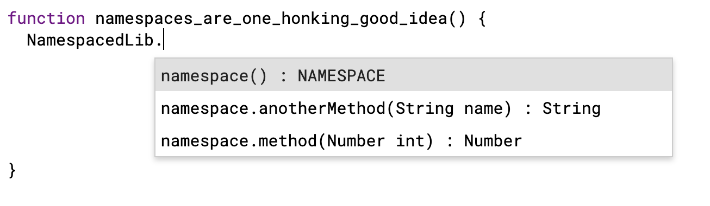

# NamespacedLib

Proof of concept of how to get namespaces (sorta) in Google Apps Scripts libraries

## Quickstart

1. Add library, project ID: `MhUTT1trZNEaW2NGJlbIBTq8b30WIDiE_`
2. Type the identifier (by default `NamespacedLib`) and then the `.`
3. The methods are now organized by dotted namespaces. Whoop!
3. Check out the [source code](https://github.com/classroomtechtools/NamespacedLib/blob/master/Code.gs) and apply to your own!

## Motivation

I'd like to ensure that libraries can be self documenting and easy to follow. Namespaces are a useful thing!

## How it werks

I discovered that the jsdoc `@name` annotation (which is not documented in gas documentation) is actually recognized, and I got to thinking, for what useful purpose could it be used?

## Further research

The advanced libraries have namespaces, too, and I figure that they must use the `@name` annotation to implement it. Maybe there are other annotations available waiting to be discovered? If you use an advanced library, you'll also notice that there are subtle differences compared to this solution. Hmmm...
